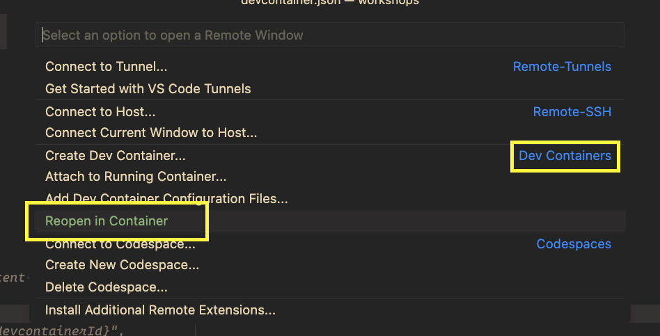
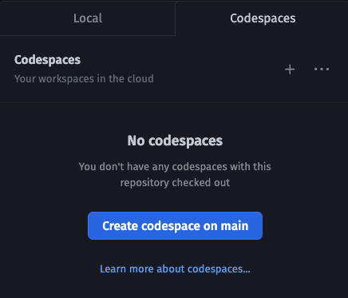

# Setup

There are a few ways to set up the development environment in order to follow this workshop:

- configuring your local environment
- using a local dev container
- using GitHub Codespaces

If working on your machine (i.e. not using GitHub Codespaces), first clone the repository locally:

```bash
$ git clone https://github.com/fermyon/workshops && cd workshops
```

### Configuring your local environment

First, you have to configure [Spin](https://fermyon.com/spin) by following the [instructions for your operating system from the Spin documentation](https://developer.fermyon.com/spin/install).

For example, to install Spin from Linux, macOS, or WSL2, run the following commands:

```bash
$ curl -fsSL https://developer.fermyon.com/downloads/install.sh | bash
$ sudo mv spin /usr/local/bin/
```

Alternatively, you can [manually install from a GitHub release](https://github.com/fermyon/spin/releases), or you can [build Spin from source](https://developer.fermyon.com/spin/contributing-spin).

At this point, you should be able to run Spin commands:

```bash
$ spin --version
spin 1.0.0
```

Now you can configure the templates and plugins we will use as part of this workshop:

```bash
# Install the official Spin templates.
$ spin templates install --git https://github.com/fermyon/spin --update
$ spin templates install --git https://github.com/fermyon/spin-js-sdk --update

# Install a few templates we will use to build applications.
$ spin templates install --git https://github.com/radu-matei/spin-kv-explorer --update
$ spin templates install --git https://github.com/radu-matei/spin-nextjs --update

# Install the JavaScript plugin for Spin.
$ spin plugin install js2wasm -y
```

Depending on the programming languages you want to use, you will need to configure their toolchains. For example:

- [Rust](https://www.rust-lang.org/learn/get-started) (including the Wasm/WASI target: `rustup target install wasm32-wasi`)
- [Node.js and NPM](https://docs.npmjs.com/downloading-and-installing-node-js-and-npm)
- [Go](https://go.dev/doc/install) and [TinyGo](https://tinygo.org/getting-started/install)
- [.NET](https://dotnet.microsoft.com/en-us/download/dotnet/7.0)

### Using a local dev container with VS Code

This repository contains the necessary files to open the project and develop inside a container, using [Visual Studio Code Dev Containers](https://code.visualstudio.com/docs/devcontainers/containers).

After [following the VS Code documentation](https://code.visualstudio.com/docs/devcontainers/tutorial), you can open the directory in a container:



### Using GitHub Codespaces

You can complete this workshop using only your browser using [GitHub Codespaces](https://github.com/features/codespaces). To achieve this, navigate to the GitHub repository for this workshop, https://github.com/fermyon/workshops, then click on the "Clone, open, or download button", then select "Codespaces", click "Create codespace on main`, then follow the instructions:




### Troubleshooting

#### Q: I cannot build my Rust application with `spin build`.

A: Make sure you have [configured your Rust toolchain](https://www.rust-lang.org/tools/install), and have added the `wasm32-wasi` target using `rustup target add wasm32-wasi`.

#### Q: I cannot build my JavaScript or TypeScript application with `spin build`.

A: Make sure you have [configured Node.js and `npm`](https://docs.npmjs.com/downloading-and-installing-node-js-and-npm), and that you have executed `npm install` in the directory with your component's `package.json` file that contains the dependencies.
